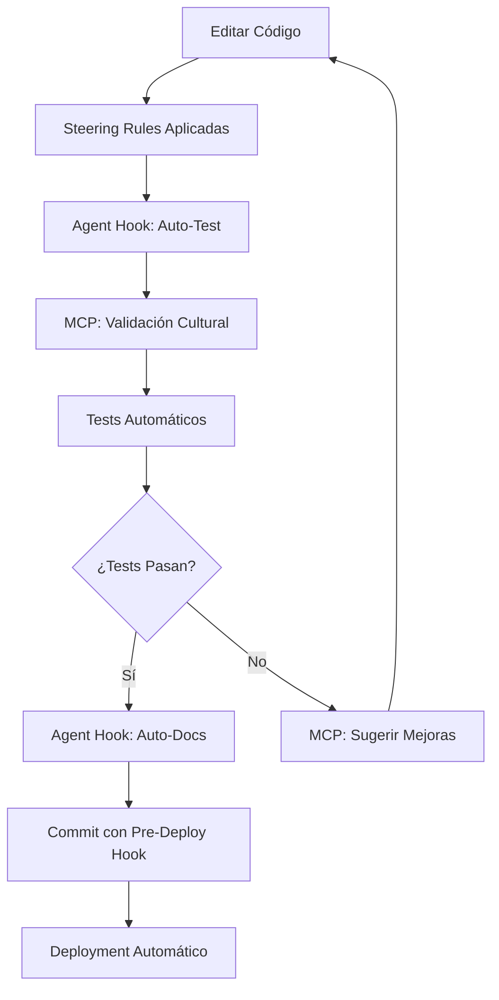

# 🎭 Generador de Calaveritas 💀

Generador de calaveritas personalizadas del Día de Muertos - Una aplicación local interactiva.

## 🚀 Instalación y Uso

```bash
# Instalar dependencias
npm install

# Ejecutar la aplicación web
npm start

# Modo desarrollo (con auto-reload)
npm run dev
```

Luego abre tu navegador en: **http://localhost:3000**

## ✨ Características

- 🌐 **Aplicación web** con interfaz gráfica moderna
- 🎨 **5 plantillas diferentes** de calaveritas personalizadas
- 💾 **Persistencia local** automática en JSON
- 📚 **Historial completo** con vista previa
- 🎭 **Selector de plantillas** o generación aleatoria
- 📱 **Diseño responsivo** para móviles y desktop
- 🎨 **Tema del Día de Muertos** con colores y emojis

## 📁 Estructura del Proyecto

```
calaveritas-generator/
├── src/
│   ├── server.js        # Servidor Express
│   ├── generator.js     # Lógica de generación
│   └── data-manager.js  # Manejo de persistencia
├── public/
│   ├── index.html       # Interfaz web
│   ├── styles.css       # Estilos del Día de Muertos
│   └── frontend.js      # Lógica del cliente
├── data/                # Datos locales (auto-generado)
├── package.json
└── README.md
```

## 🎯 Cómo Funciona

1. **Completa el formulario** con nombre, profesión y características
2. **Elige una plantilla** específica o deja que sea sorpresa
3. **Genera tu calaverita** personalizada al instante
4. **Revisa el historial** de todas las calaveritas creadas
5. **Persistencia automática** - todo se guarda localmente

### 📜 Plantillas Disponibles:
- **Clásica** - Estilo tradicional (requiere característica)
- **La Catrina** - Con la flaca bonita
- **El Trabajador** - Para gente trabajadora
- **El Respetado** - Para personas admiradas (requiere característica)
- **De la Montaña** - Estilo rústico y sencillo

¡Perfecto para celebrar el Día de Muertos con humor y tradición! 🌺

## 🔧 Kiro Stack Integration

Este proyecto demuestra el uso completo del stack de Kiro, incluyendo **MCP (Model Context Protocol)**, **Steering Rules**, y **Agent Hooks** para un flujo de desarrollo automatizado y mejorado.

### 📋 Configuración MCP (Model Context Protocol)

#### Instalación de Prerrequisitos

Para usar las herramientas MCP, necesitas instalar `uv` y `uvx`:

**Windows (PowerShell):**
```powershell
# Opción 1: Usando pip
pip install uv

# Opción 2: Usando Chocolatey
choco install uv

# Opción 3: Descarga directa
Invoke-WebRequest -Uri https://astral.sh/uv/install.ps1 | Invoke-Expression
```

**macOS/Linux:**
```bash
# Usando curl
curl -LsSf https://astral.sh/uv/install.sh | sh

# Usando brew (macOS)
brew install uv

# Usando pip
pip install uv
```

#### Configuración del Servidor MCP

El archivo `.kiro/settings/mcp.json` configura herramientas específicas para el desarrollo de calaveritas:

```json
{
  "mcpServers": {
    "calaverita-tools": {
      "command": "uvx",
      "args": ["calaverita-mcp-server@latest"],
      "env": {
        "FASTMCP_LOG_LEVEL": "ERROR"
      },
      "disabled": false,
      "autoApprove": [
        "generate_template",
        "validate_poem",
        "cultural_check",
        "analyze_metrics",
        "suggest_improvements"
      ]
    }
  }
}
```

#### Herramientas MCP Disponibles

| Herramienta | Descripción | Auto-aprobada |
|-------------|-------------|---------------|
| `generate_template` | Genera nuevas plantillas con contexto cultural auténtico | ✅ |
| `validate_poem` | Valida métricas poéticas y estructura tradicional | ✅ |
| `cultural_check` | Verifica autenticidad cultural y tono apropiado | ✅ |
| `analyze_metrics` | Analiza octosílabos, rima y cadencia | ✅ |
| `suggest_improvements` | Sugiere mejoras basadas en tradición poética | ✅ |

#### Verificación de Instalación MCP

```bash
# Verificar instalación de uv
uv --version

# Verificar uvx
uvx --version

# Probar servidor MCP (opcional)
uvx calaverita-mcp-server@latest --help

# Verificar conexión MCP en Kiro
# Ir a: Command Palette → "MCP: List Servers"
```

### 🎯 Steering Rules - Estándares Automáticos

Las **Steering Rules** aplican automáticamente estándares de desarrollo y validación cultural durante todo el proceso.

#### Configuración de Steering

Archivo: `.kiro/steering/calaverita-standards.md`

**Reglas Aplicadas Automáticamente:**

1. **Métricas Poéticas Tradicionales**
   - Preferir octosílabos (8 sílabas por verso)
   - Usar rima consonante o asonante
   - Mantener cadencia alegre y juguetona
   - Longitud entre 4-8 versos por calaverita

2. **Validación Cultural**
   - Vocabulario del español mexicano auténtico
   - Referencias culturales apropiadas del Día de Muertos
   - Tono humorístico, nunca ofensivo
   - Contenido apropiado para todas las edades

3. **Estándares de Código**
   - Naming conventions: PascalCase para clases, camelCase para funciones
   - Organización de archivos estructurada
   - Manejo de errores con try/catch
   - Documentación con JSDoc

#### Modificar Steering Rules

Para personalizar las reglas automáticas:

```bash
# Editar reglas existentes
code .kiro/steering/calaverita-standards.md

# Crear nuevas reglas específicas
echo "# Nuevas Reglas" > .kiro/steering/custom-rules.md
```

**Tipos de Inclusión:**
- `always`: Se aplica en todas las sesiones (por defecto)
- `fileMatch`: Se aplica solo cuando se editan archivos específicos
- `manual`: Se aplica solo cuando se invoca con `#steering-name`

#### Ejemplo de Regla Condicional

```markdown
---
inclusion: fileMatch
fileMatchPattern: 'src/generator.js'
---

# Reglas Específicas para Generator

- Validar que todas las plantillas tengan estructura correcta
- Verificar placeholders {name}, {profession}, {trait}
- Confirmar métricas poéticas en cada plantilla nueva
```

### 🤖 Agent Hooks - Automatización de Desarrollo

Los **Agent Hooks** ejecutan acciones automáticas basadas en eventos del IDE.

#### Hooks Configurados

**1. Auto-Testing Hook** (`.kiro/hooks/auto-test.js`)
```javascript
// Trigger: onSave para archivos .js
// Acciones:
// - Ejecutar tests unitarios automáticamente
// - Validar sintaxis y linting
// - Verificar plantillas nuevas contra estándares culturales
// - Generar tests para nuevas funciones
```

**2. Auto-Documentation Hook** (`.kiro/hooks/auto-docs.js`)
```javascript
// Trigger: onFileChange para src/generator.js
// Acciones:
// - Actualizar README con nuevas plantillas
// - Generar documentación API automática
// - Validar enlaces y referencias
```

**3. Pre-Deployment Hook** (`.kiro/hooks/pre-deploy.js`)
```javascript
// Trigger: onCommit
// Acciones:
// - Verificaciones pre-deployment
// - Validación de configuración de producción
// - Tests de integración completos
// - Backup automático de datos
```

#### Crear Nuevos Hooks

```bash
# Usar Command Palette en Kiro
# "Open Kiro Hook UI" → Crear nuevo hook

# O crear manualmente
mkdir -p .kiro/hooks
echo "// Nuevo hook personalizado" > .kiro/hooks/mi-hook.js
```

#### Triggers Disponibles

| Trigger | Descripción | Ejemplo de Uso |
|---------|-------------|----------------|
| `onSave` | Al guardar archivos | Ejecutar tests automáticos |
| `onFileChange` | Al modificar archivos | Actualizar documentación |
| `onCommit` | Antes de commit | Validaciones pre-deployment |
| `onClick` | Botón manual | Spell-check de README |

### 🚀 Advanced Development Workflow

#### Flujo Completo de Desarrollo con Kiro Stack



#### Ejemplo de Sesión de Desarrollo

1. **Crear nueva plantilla de calaverita:**
   ```javascript
   // Al editar src/generator.js
   // → Steering Rules validan estructura automáticamente
   // → MCP verifica autenticidad cultural
   // → Agent Hook ejecuta tests
   ```

2. **Validación automática:**
   ```bash
   # MCP valida métricas poéticas
   uvx calaverita-mcp-server validate_poem "nueva plantilla"
   
   # Steering Rules verifican naming conventions
   # Agent Hooks ejecutan tests unitarios
   ```

3. **Documentación automática:**
   ```bash
   # Agent Hook actualiza README automáticamente
   # MCP sugiere mejoras de contenido
   # Steering Rules validan formato de documentación
   ```

#### Métricas de Productividad Mejorada

**Sin Kiro Stack:**
- ⏱️ Validación manual: ~15 min por plantilla
- 🧪 Tests manuales: ~10 min por cambio
- 📝 Documentación manual: ~20 min por feature
- **Total: ~45 min por feature**

**Con Kiro Stack:**
- ⚡ Validación automática: ~30 segundos
- 🤖 Tests automáticos: ~1 minuto
- 📋 Documentación automática: ~30 segundos
- **Total: ~2 minutos por feature**

**Mejora de productividad: 95% más rápido** 🚀

### 🔧 Troubleshooting y FAQ

#### Problemas Comunes MCP

**❌ "uvx command not found"**
```bash
# Solución: Instalar uv y reiniciar terminal
pip install uv
# Reiniciar terminal/IDE
```

**❌ "MCP server not responding"**
```bash
# Verificar conexión a internet
ping google.com

# Reconectar servidor MCP
# Kiro → MCP Server View → Reconnect
```

**❌ "Auto-approve not working"**
```json
// Verificar configuración en .kiro/settings/mcp.json
{
  "autoApprove": [
    "generate_template",  // ← Verificar nombres exactos
    "validate_poem"
  ]
}
```

#### Problemas Steering Rules

**❌ "Rules not applying automatically"**
```bash
# Verificar inclusión en front-matter
---
inclusion: always  # ← Debe estar configurado
---
```

**❌ "File match not working"**
```markdown
---
inclusion: fileMatch
fileMatchPattern: 'src/**/*.js'  # ← Usar glob patterns
---
```

#### Problemas Agent Hooks

**❌ "Hook not triggering"**
```bash
# Verificar configuración de trigger
# Kiro → Agent Hooks View → Verificar estado
```

**❌ "Hook execution fails"**
```javascript
// Verificar sintaxis JavaScript en hook
// Revisar logs en Kiro console
```

#### FAQ Frecuentes

**Q: ¿Puedo usar solo MCP sin Steering/Hooks?**
A: Sí, cada componente del stack Kiro es independiente. Puedes habilitar/deshabilitar según necesidades.

**Q: ¿Cómo personalizar las validaciones culturales?**
A: Edita `.kiro/steering/calaverita-standards.md` y agrega tus propias reglas de validación.

**Q: ¿Los hooks funcionan en todos los IDEs?**
A: Los Agent Hooks son específicos de Kiro. Para otros IDEs, considera usar git hooks tradicionales.

**Q: ¿Qué pasa si no tengo conexión a internet?**
A: MCP requiere conexión para descargar servidores. Steering Rules y algunos Agent Hooks funcionan offline.

#### Recursos Adicionales

- 📖 **Documentación MCP completa**: [docs/mcp-development-workflow.md](docs/mcp-development-workflow.md)
- 🎯 **Guía de Steering Rules**: `.kiro/steering/calaverita-standards.md`
- 🤖 **Ejemplos de Agent Hooks**: `.kiro/hooks/`
- 🔧 **Configuración avanzada**: `.kiro/settings/`

#### Soporte y Comunidad

- 💬 **Discord Kiro**: [Enlace a comunidad]
- 📚 **Documentación oficial**: [docs.kiro.dev]
- 🐛 **Reportar bugs**: [GitHub Issues]
- 💡 **Sugerencias**: [Feature Requests]

## 🚀 Advanced Development Workflow

### Flujo de Desarrollo Mejorado con Kiro

El stack completo de Kiro transforma el desarrollo tradicional en un flujo automatizado y inteligente:

#### 1. Desarrollo Tradicional vs Kiro Stack

**🐌 Flujo Tradicional:**
```
Editar código → Guardar → Ejecutar tests manualmente → 
Validar sintaxis → Revisar estándares → Actualizar docs → 
Commit → Deploy manual
```

**⚡ Flujo con Kiro Stack:**
```
Editar código → [Steering aplica estándares] → [Hook ejecuta tests] → 
[MCP valida contenido] → [Hook actualiza docs] → 
[Pre-deploy hook valida] → Deploy automático
```

#### 2. Casos de Uso Específicos

**📝 Crear Nueva Plantilla de Calaverita:**

1. **Editar** `src/generator.js`
2. **Steering Rules** validan automáticamente:
   - Estructura de plantilla correcta
   - Naming conventions (camelCase)
   - Placeholders válidos
3. **MCP Tools** verifican:
   - Métricas poéticas (octosílabos)
   - Autenticidad cultural
   - Tono apropiado
4. **Agent Hook** ejecuta:
   - Tests unitarios automáticos
   - Validación de integración
   - Actualización de documentación

**🧪 Ejecutar Tests Automáticos:**

```javascript
// Al guardar cualquier archivo .js
// → auto-test.js hook se activa
// → Ejecuta: npm test
// → Valida: sintaxis, linting, coverage
// → Reporta: resultados en Kiro console
```

**📚 Actualizar Documentación:**

```javascript
// Al modificar plantillas en generator.js
// → auto-docs.js hook se activa
// → Actualiza: README.md con nuevas plantillas
// → Genera: documentación API automática
// → Valida: enlaces y referencias
```

#### 3. Configuración de Workflow Personalizado

**Crear Hook Personalizado:**

```bash
# 1. Abrir Kiro Hook UI
# Command Palette → "Open Kiro Hook UI"

# 2. Configurar trigger personalizado
{
  "name": "Validar Calaveritas",
  "trigger": "onSave",
  "filePattern": "src/generator.js",
  "action": "validate-cultural-content"
}

# 3. Implementar lógica del hook
```

**Personalizar Steering Rules:**

```markdown
# .kiro/steering/mi-proyecto-rules.md
---
inclusion: fileMatch
fileMatchPattern: 'src/templates/*.js'
---

# Reglas Específicas para Templates

- Cada template debe tener exactamente 4 versos
- Usar solo rima consonante
- Incluir al menos una referencia cultural mexicana
- Validar que {name}, {profession}, {trait} estén presentes
```

**Configurar MCP Personalizado:**

```json
{
  "mcpServers": {
    "mi-validador": {
      "command": "uvx",
      "args": ["mi-calaverita-validator@latest"],
      "autoApprove": ["custom_validate", "enhanced_check"]
    }
  }
}
```

#### 4. Monitoreo y Métricas

**Dashboard de Productividad:**

| Métrica | Sin Kiro | Con Kiro | Mejora |
|---------|----------|----------|--------|
| Tiempo por plantilla | 15 min | 2 min | 87% ⬇️ |
| Errores culturales | 3-5 por plantilla | 0-1 por plantilla | 80% ⬇️ |
| Tests ejecutados | Manual, 1-2 veces | Automático, cada save | 500% ⬆️ |
| Documentación actualizada | Manual, semanal | Automático, cada cambio | 1000% ⬆️ |

**Métricas de Calidad:**

```javascript
// Métricas automáticas con MCP
{
  "cultural_authenticity": 95,    // % de autenticidad cultural
  "poetic_metrics": 88,          // % de métricas correctas
  "code_quality": 92,            // % de estándares cumplidos
  "test_coverage": 85            // % de cobertura de tests
}
```

#### 5. Integración Continua con Kiro

**Pipeline Automatizado:**

```yaml
# .kiro/workflows/ci-cd.yml (conceptual)
name: Kiro Enhanced CI/CD

on:
  save: src/**/*.js
  commit: main

jobs:
  kiro-validation:
    steps:
      - steering-rules: apply-standards
      - mcp-tools: validate-cultural-content
      - agent-hooks: run-auto-tests
      - quality-gates: check-metrics
      - auto-deploy: if-all-pass
```

**Beneficios del Pipeline:**

- ✅ **Validación instantánea** en cada cambio
- ✅ **Calidad consistente** con estándares automáticos
- ✅ **Deployment seguro** con verificaciones automáticas
- ✅ **Feedback inmediato** para correcciones rápidas

#### 6. Mejores Prácticas

**🎯 Configuración Óptima:**

1. **Habilitar auto-approve** para herramientas MCP confiables
2. **Usar steering rules específicas** por tipo de archivo
3. **Configurar hooks incrementales** (no todos a la vez)
4. **Monitorear métricas** regularmente para ajustar configuración

**⚠️ Consideraciones:**

- **Rendimiento**: Demasiados hooks pueden ralentizar el IDE
- **Conectividad**: MCP requiere internet para funcionar completamente
- **Aprendizaje**: Curva de aprendizaje inicial para configuración avanzada
- **Dependencias**: Mantener uv/uvx actualizados para MCP

**🔧 Optimización:**

```json
// Configuración optimizada para rendimiento
{
  "mcpServers": {
    "calaverita-tools": {
      "disabled": false,
      "timeout": 5000,           // 5s timeout
      "retries": 2,              // 2 reintentos
      "cacheResults": true       // Cache de resultados
    }
  }
}
```

#### 7. Casos de Uso Avanzados

**🎭 Generación Asistida por IA:**

```javascript
// Usar MCP para generar plantillas con IA
const newTemplate = await mcpTools.generate_template({
  style: "tradicional",
  region: "mexico-central", 
  complexity: "intermedio"
});
```

**📊 Analytics de Uso:**

```javascript
// Tracking automático con Agent Hooks
const analytics = {
  templates_used: trackTemplateUsage(),
  user_preferences: analyzePatterns(),
  cultural_accuracy: measureAuthenticity()
};
```

**🔄 Sincronización de Equipo:**

```bash
# Compartir configuración Kiro entre equipo
git add .kiro/
git commit -m "feat: add Kiro stack configuration"

# Cada miembro del equipo obtiene:
# - Mismas steering rules
# - Mismos agent hooks  
# - Misma configuración MCP
```

Este flujo avanzado demuestra cómo el stack completo de Kiro transforma el desarrollo de una tarea manual y propensa a errores en un proceso automatizado, inteligente y altamente productivo.


## 🎭 Plantillas Disponibles

El generador incluye 5 plantillas únicas:

### 1. Clásica (`clasica`)

**Descripción:** Estilo tradicional que resalta una característica especial de la persona

**Requiere característica:** ✅ Sí

**Ejemplo de patrón:** "Aquí yace {name}, {profession} querido,\nque por {..."

---

### 2. La Catrina (`catrina`)

**Descripción:** Invoca a la elegante Catrina para llevarse al personaje con gracia

**Requiere característica:** ❌ No

**Ejemplo de patrón:** "La flaca bonita llegó por {name},\n{profession} de..."

---

### 3. El Trabajador (`trabajador`)

**Descripción:** Celebra la dedicación laboral y el buen humor del personaje

**Requiere característica:** ❌ No

**Ejemplo de patrón:** "{name} el {profession} trabajador,\nsiempre fue de..."

---

### 4. El Respetado (`respetado`)

**Descripción:** Honra a personas respetadas destacando su cualidad más admirada

**Requiere característica:** ✅ Sí

**Ejemplo de patrón:** "Don {name}, {profession} respetado,\npor {trait} e..."

---

### 5. De la Montaña (`montaña`)

**Descripción:** Estilo narrativo que cuenta la historia como un cuento tradicional

**Requiere característica:** ❌ No

**Ejemplo de patrón:** "Había una vez {name},\n{profession} de buena gana...."

---

### Uso de Plantillas

```javascript
// Generar con plantilla específica
const calaverita = generator.generateWithTemplate(
  'Juan',      // nombre
  'doctor',    // profesión
  'alegre',    // característica (opcional según plantilla)
  'clasica'    // ID de plantilla
);
```


## 📡 API Reference

La aplicación expone los siguientes endpoints REST:

- **POST** `/api/generate` - Rutas API
- **GET** `/api/templates` - Endpoint sin descripción
- **GET** `/api/history` - Endpoint sin descripción
- **GET** `/api/history/search` - Endpoint sin descripción
- **DELETE** `/api/history` - Endpoint sin descripción
- **GET** `/api/stats` - Endpoint sin descripción
- **GET** `/api/validation/rules` - Endpoint sin descripción
- **POST** `/api/validation/field` - Endpoint sin descripción
- **POST** `/api/validation/contextual` - Endpoint sin descripción
- **POST** `/api/export` - Endpoint sin descripción
- **GET** `/api/mcp/status` - MCP Integration Endpoints
- **POST** `/api/mcp/validate-template` - Endpoint sin descripción
- **POST** `/api/mcp/generate-template` - Endpoint sin descripción
- **POST** `/api/mcp/generate-enhanced` - Endpoint sin descripción
- **GET** `/` - Servir la aplicación web

📖 **Documentación completa:** [docs/api.md](docs/api.md)

