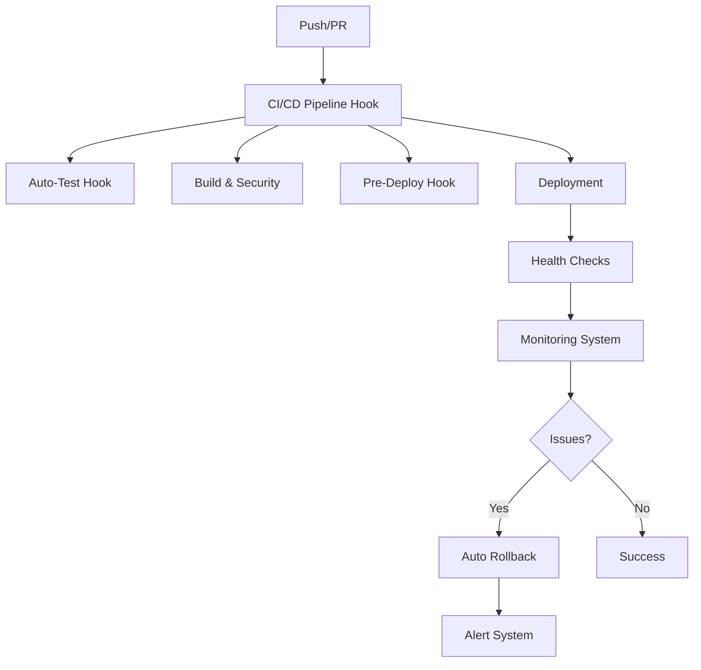

# 🚀 CI/CD Automation with Kiro Agent Hooks

Este documento describe el sistema completo de CI/CD automatizado implementado usando Agent Hooks de Kiro para el Generador de Calaveritas.

## 📋 Tabla de Contenidos

- [Arquitectura del Pipeline](#arquitectura-del-pipeline)
- [Agent Hooks Implementados](#agent-hooks-implementados)
- [Scripts de Automatización](#scripts-de-automatización)
- [Configuración y Uso](#configuración-y-uso)
- [Monitoreo y Alertas](#monitoreo-y-alertas)
- [Rollback Automático](#rollback-automático)
- [Mejores Prácticas](#mejores-prácticas)

## 🏗️ Arquitectura del Pipeline

### Pipeline Completo



### Componentes Principales

1. **CI/CD Pipeline Hook** - Orquestador principal del pipeline
2. **Auto-Test Hook** - Testing y validación automática
3. **Auto-Docs Hook** - Documentación automática
4. **Pre-Deploy Hook** - Validaciones pre-deployment
5. **Deployment Automation** - Script de deployment automatizado
6. **Monitoring System** - Monitoreo continuo y alertas
7. **Rollback System** - Rollback automático en caso de errores

## 🔧 Agent Hooks Implementados

### 1. CI/CD Pipeline Hook (`.kiro/hooks/ci-cd-pipeline.js`)

**Propósito**: Orquestador principal que maneja el flujo completo de CI/CD.

**Triggers**:
- `onPush` - Ejecuta pipeline completo en push a main/master
- `onPullRequest` - Ejecuta validaciones para PRs
- `onSchedule` - Pipelines programados (nightly, weekly, monthly)

**Stages del Pipeline**:
1. **Test** - Tests unitarios, integración, calidad de código
2. **Build** - Validación de estructura, optimización de assets
3. **Security** - Scans de seguridad, validación de vulnerabilidades
4. **Deploy** - Deployment a staging/production
5. **Verify** - Health checks, smoke tests, validación de performance

**Ejemplo de uso**:
```javascript
// Trigger manual del pipeline
const pipeline = new CICDPipelineHook();
await pipeline.onPush('main', 'abc123def');
```

### 2. Auto-Test Hook (`.kiro/hooks/auto-test.js`)

**Propósito**: Testing automático y validación de código.

**Triggers**:
- `onSave` - Validación al guardar archivos .js
- `onFileChange` - Validación ligera en cambios
- `onCommit` - Suite completa de tests pre-commit

**Funcionalidades**:
- Validación de sintaxis JavaScript
- Linting automático con reglas configurables
- Validación de estándares culturales para plantillas
- Generación automática de tests faltantes
- Ejecución de tests relacionados

**Configuración de estándares culturales**:
```javascript
culturalStandards: {
  forbiddenWords: ['muerte violenta', 'asesinato', 'suicidio'],
  requiredTone: 'humorístico',
  traditionalMetrics: {
    syllablesPerLine: 8, // Octosílabos tradicionales
    rhymeScheme: ['consonante', 'asonante']
  }
}
```

### 3. Auto-Docs Hook (`.kiro/hooks/auto-docs.js`)

**Propósito**: Documentación automática y validación de enlaces.

**Triggers**:
- `onTemplateAdd` - Actualiza documentación al agregar plantillas
- `onApiChange` - Regenera documentación API
- `onDocumentationChange` - Valida enlaces y referencias

**Funcionalidades**:
- Actualización automática de README.md
- Generación de documentación API
- Validación de enlaces internos
- Creación de documentación específica por plantilla

### 4. Pre-Deploy Hook (`.kiro/hooks/pre-deploy.js`)

**Propósito**: Validaciones exhaustivas antes del deployment.

**Validaciones incluidas**:
- Estructura del proyecto
- Configuración de producción
- Tests de integración completos
- Verificaciones de seguridad
- Validación de dependencias
- Verificación de assets

## 🛠️ Scripts de Automatización

### 1. Deployment Automation (`scripts/deploy-automation.js`)

**Funcionalidades**:
- Deployment automatizado a staging/production
- Creación automática de backups
- Health checks post-deployment
- Rollback automático en caso de errores

**Comandos disponibles**:
```bash
# Deployment a staging
npm run deploy:staging

# Deployment a production
npm run deploy:production

# Rollback manual
npm run rollback

# Estado del deployment
npm run deploy:status
```

**Configuración de ambientes**:
```javascript
environments: {
  staging: {
    port: 8080,
    nodeEnv: 'staging',
    logLevel: 'debug'
  },
  production: {
    port: 3000,
    nodeEnv: 'production',
    logLevel: 'error'
  }
}
```

### 2. Monitoring System (`scripts/monitoring-system.js`)

**Funcionalidades**:
- Monitoreo continuo de la aplicación
- Health checks automáticos
- Detección de anomalías
- Sistema de alertas multi-canal
- Métricas de performance

**Comandos disponibles**:
```bash
# Iniciar monitoreo continuo
npm run monitor:start

# Detener monitoreo
npm run monitor:stop

# Estado del monitoreo
npm run monitor:status

# Health check manual
npm run monitor:health
```

**Métricas monitoreadas**:
- Tiempo de respuesta de la aplicación
- Uso de memoria y CPU
- Tasa de errores
- Disponibilidad de endpoints
- Integridad de datos

## ⚙️ Configuración y Uso

### Configuración Inicial

1. **Instalar dependencias**:
```bash
npm install
```

2. **Configurar MCP** (si no está configurado):
```bash
# El archivo .kiro/settings/mcp.json ya está configurado
# Verificar que uv/uvx estén instalados para MCP
```

3. **Verificar hooks**:
```bash
# Los hooks se cargan automáticamente
# Verificar en .kiro/hooks/
```

### Flujo de Desarrollo Automatizado

1. **Desarrollo local**:
```bash
npm run dev  # Inicia servidor con watch mode
```

2. **Al guardar archivos** - Auto-Test Hook se ejecuta automáticamente:
   - Validación de sintaxis
   - Linting
   - Tests relacionados
   - Validación cultural (para plantillas)

3. **Al hacer commit** - Validaciones pre-commit:
   - Suite completa de tests
   - Validación de todos los archivos cambiados
   - Verificación de integridad

4. **Al hacer push** - Pipeline completo:
   - Tests de integración
   - Build y optimización
   - Scans de seguridad
   - Deployment automático (según branch)

### Deployment Manual

```bash
# Deployment a staging
npm run deploy:staging

# Deployment a production (requiere validaciones adicionales)
npm run deploy:production

# Verificar estado
npm run deploy:status
```

### Monitoreo

```bash
# Iniciar monitoreo en background
npm run monitor:start

# Verificar salud de la aplicación
npm run monitor:health
```

## 📊 Monitoreo y Alertas

### Sistema de Alertas

El sistema de monitoreo incluye alertas automáticas con diferentes niveles de severidad:

- **🟢 Low** - Información general, no requiere acción
- **🟡 Medium** - Requiere atención, notificación activada
- **🔴 High** - Problema serio, notificación inmediata
- **🚨 Critical** - Falla crítica, notificación urgente + posible rollback

### Canales de Notificación

1. **Console** - Logs en tiempo real
2. **File** - Alertas guardadas en `.monitoring/alerts/`
3. **Webhook** - Integración con sistemas externos (Slack, etc.)

### Métricas Clave

```javascript
alertThresholds: {
  responseTime: 2000,    // 2 segundos
  errorRate: 0.05,       // 5%
  memoryUsage: 0.8,      // 80%
  diskUsage: 0.9         // 90%
}
```

## 🔄 Rollback Automático

### Triggers de Rollback Automático

1. **Health checks fallidos** después del deployment
2. **Tasa de errores alta** detectada por monitoreo
3. **Falla crítica** en verificaciones post-deployment

### Proceso de Rollback

1. **Detección automática** de problemas
2. **Backup automático** antes de cada deployment
3. **Restauración** desde el último backup válido
4. **Verificación** del rollback
5. **Notificación** del rollback completado

### Rollback Manual

```bash
# Rollback inmediato al último backup
npm run rollback
```

## 📈 Métricas y Reportes

### Dashboard de Analytics MCP

La aplicación incluye un dashboard completo de analytics accesible desde la interfaz web:

- **Métricas en tiempo real**
- **Analytics de plantillas** con validación MCP
- **Comportamiento de usuarios**
- **Métricas de calidad cultural y poética**
- **Tendencias y recomendaciones**

### Reportes Automáticos

- **Nightly** - Reporte completo de métricas diarias
- **Weekly** - Análisis de tendencias semanales
- **Monthly** - Reporte ejecutivo mensual

## 🎯 Mejores Prácticas

### Desarrollo

1. **Commits pequeños y frecuentes** - Facilita debugging y rollback
2. **Mensajes de commit descriptivos** - Mejora trazabilidad
3. **Tests antes de commit** - Usa `npm run ci:test`
4. **Validación cultural** - Especialmente importante para plantillas

### Deployment

1. **Siempre deployar a staging primero**
2. **Verificar health checks** antes de production
3. **Monitorear métricas** después del deployment
4. **Mantener backups** - Se crean automáticamente

### Monitoreo

1. **Revisar alertas regularmente**
2. **Configurar umbrales apropiados** según el uso
3. **Mantener logs limpios** - Evitar console.log en production
4. **Documentar incidentes** para mejora continua

## 🔧 Troubleshooting

### Problemas Comunes

1. **Pipeline falla en tests**:
   ```bash
   # Ejecutar tests localmente
   npm run ci:test
   # Revisar logs específicos
   ```

2. **Deployment falla**:
   ```bash
   # Verificar pre-requisitos
   npm run ci:predeploy
   # Revisar estado
   npm run deploy:status
   ```

3. **Monitoreo no inicia**:
   ```bash
   # Verificar permisos
   # Revisar logs en .monitoring/
   npm run monitor:status
   ```

### Logs y Debugging

- **Pipeline logs**: `.kiro/pipelines/history.json`
- **Deployment logs**: `.deployments/state.json`
- **Monitoring logs**: `.monitoring/state.json`
- **Alertas**: `.monitoring/alerts/`

## 📚 Referencias

- [Kiro Agent Hooks Documentation](../README.md#agent-hooks)
- [MCP Integration Guide](../README.md#mcp-integration)
- [Steering Rules](../.kiro/steering/calaverita-standards.md)
- [API Documentation](./api.md)

---

**Nota**: Este sistema de CI/CD está diseñado específicamente para el Code of the Dead Challenge y demuestra el uso completo del stack de Kiro para automatización de desarrollo.